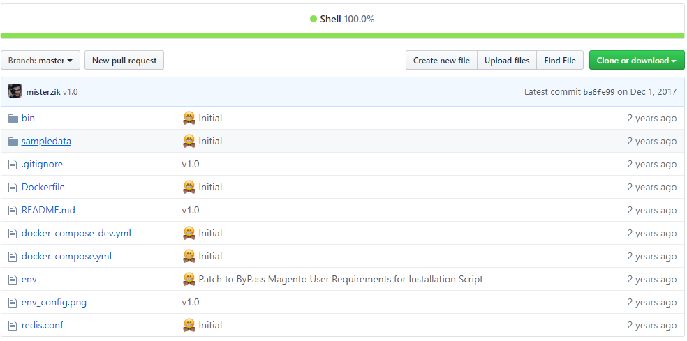

# Do-mag-ic

#### Behind the scene - Instance Automation
##### Summary

If you're in data center or cloud IT circles, you've been hearing about containers in general and Docker in particular non-stop for a few years now. With the release of Docker 1.0 in June 2014, the buzz became a roar.
All the noise is happening because companies are adopting Docker at a remarkable rate.

At OSCon in July 2014, I ran into numerous businesses that were already moving their server applications from virtual machines (VM) to containers. Indeed, James Turnbull, Docker's VP of services and support, told me at the conference that three of the largest banks that had been using Docker in beta were moving it into production. That's a heck of a confident move for any 1.0 technology, but it's almost unheard of in the safety-first financial world.

Three years later, Docker is bigger than ever. Forrester analyst Dave Bartoletti thinks only 10 percent of enterprises currently use containers in production now, but up to a third are testing them. 451 Research agrees. By 451's count, container technologies, most of it Docker, generated $762 million in revenue in 2016. In 2020, 451 forecasts revenue will reach $2.7 billion, for a 40 percent compound annual growth rate (CAGR).
Docker, an open-source technology, isn't just the darling of Linux powers such as Red Hat and Canonical. Proprietary software companies such as Microsoft have also embraced Docker.

Source:
http://www.zdnet.com/article/what-is-docker-and-why-is-it-so-darn-popular/

---

### Get started with Magento Instance & Docker

#### Basic Setup

As for any Magento development environment, We will need a few micro-services which includes a web server running a PHP client, Database server running MySQL all this can be achieve by acquiring a small Debian Instance as our Operating System from Digital Ocean or AWS.

Luckily for us any of these services can be installed and run as a LXC container, or also known as Docker. There is an official Docker image on the Hub, that will be utilizing to speed-up the process, i also included a from scratch method, that could utilize for advanced users, or people just interested on seen how everythings works.

Let’s begin by running our already included `docker-compose.yml` file.

Note: This version comes pre-packed with the image needed to get the Magento Instance running without much knowledge of Dockers, If your more of Advanced User, or will like to understand how we can create an image that is already created by Docker Hub, Please utilize `docker-compose-dev.yml` Which instead of building from Docker Hub Image CDN, it will build from our local `Dockerfile` also included.

This docker containers are compilation from Git-Repo’s or Docker's Repo, Which pretty much utilizes various sources to compile Magento into one single instance with it's require pieces of software-technology, and separates MySQL Instance into a different one for the options to create load-balancing colocations, The script will creating a Symbolic Link's or dependencies that will link to each other.

#### Get Started

We will be utilizing Docker Compose to run this pre-packed image, It's not needed to fully understand how everything works since script it's already built, but its highly recommended to get familiar with a few concepts, that we will be utilizing through out our script. (https://docs.docker.com/compose/)

1. `git clone https://github.com/misterzik/Do-mag-ic`
2. Open Terminal and head to recently cloned Git folder `$: cd Do-mag-ic`.
3. Please go ahead and type this command `docker-compose up -d`
4. After dependencies are downloaded and Installation done, Proceed to type `docker ps`, You should see the following entries within your command-line, Two Docker Containers, `dockermagento_web_1` which is where our Linux, PHP, Apache is hosted, and `dockermagento_mysql_1` is where the database is hosted.
5. Your Fresh-Installation is now online, The next step is to add your local domain to your hosts files, please open up new terminal and type `sudo nano /etc/hosts`, and add a new line with the new domain name, we will be using for our development instance. `127.0.0.1      local.magento`
6. Open browser and go to http://local.magento
7. Proceed to Installation manually, or highly recommended to use the automatic installation script shown  below.

---

| Environment Variables | Description | Default Value  |
| ------------- |:-------------:| -----:|
| MYSQL_HOST | MySQL Host | mysql |
| MYSQL_ROOT_PASSWORD | MYSQL ROOT PASSWORD  | Allyourbasesbelongtous |
| MYSQL_USER | MYSQL USER  | magento |
| MYSQL_PASSWORD | MYSQL PASSWORD  | magento |
| MYSQL_DATABASE | MYSQL DATABASE | magento |
| --------
| MAGENTO_LOCALE | MAGENTO LOCALE | en_US |
| MAGENTO_TIMEZONE | MAGENTO TIMEZONE | America/New_York |
| MAGENTO_DEFAULT_CURRENCY | MAGENTO DEFAULT CURRENCY | USD |
| MAGENTO_URL | MAGENTO URL | http://local.magento |
| ---------
| MAGENTO_ADMIN_FIRSTNAME | MAGENTO ADMIN FIRSTNAME | John |
| MAGENTO_ADMIN_LASTNAME | MAGENTO ADMIN LASTNAME | Doe |
| MAGENTO_ADMIN_EMAIL |  MAGENTO ADMIN EMAIL | johndoe@localhost.com |
| MAGENTO_ADMIN_USERNAME | MAGENTO ADMIN USERNAME | admin |
| MAGENTO_ADMIN_PASSWORD | MAGENTO ADMIN PASSWORD | MagentoL0$ngPas! |

---

#### Magento Automated Installation without UI

1. Use `docker ps` to find container id of images, then use `docker exec` to call install-magento script.
`docker exec -it dockermagento_web_1 install-magento`

2. After calling install-magento, Magento is installed and ready to use.
Use provided admin username and password to log into Magento backend. If you use default base url (http://local.magento) or other test url, you need to modify your host file to map the hostname to docker container.

3. Refresh browser, you should see a new installed instance of magento running.

#### History Snapshot:

so why snapshot's? in order to be able to make all this public, there is a lot of clean up to do specially with some of this old deprecated code and private tokens, so in order for me to do that i've to erase all commits for all our script kiddies out there.

